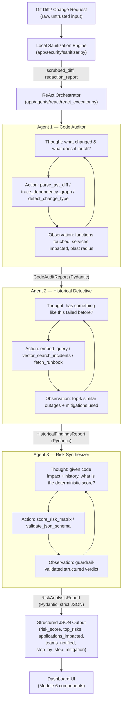
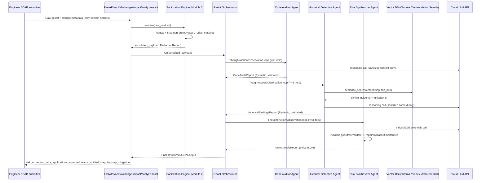

# AI Change Impact Analyzer — Production Architecture Blueprint
### ReAct Multi-Agent Edition (v2)

> Audience: Engineering reviewers / hackathon judges at a major bank.
> Scope: This document is the architectural companion to the `react/` agent
> package, the `security/sanitizer.py` privacy engine, the `rag/vertex_embeddings.py`
> + `rag/vector_search.py` retrieval layer, and the `agents/schemas.py` guardrails
> shipped in this repository. It extends (does not replace) the existing 7-agent
> mock pipeline documented in `README.md` — the new v2 surface is exposed at
> `POST /api/v2/change-impact/analyze-react` and is designed to be the
> "bank-grade" hardening pass on top of the hackathon MVP.

---

## MODULE 1 — Agentic System Architecture & Data Flow

### 1.1 Why ReAct (Reason + Act), not a static pipeline

The original 7-agent pipeline (`app/pipeline.py`) is a **fixed DAG**: every
request walks the same 7 stages regardless of whether a stage's output was
useful. That is fine for a demo, but it does not scale to real bank change
requests where:

- A one-line config diff needs almost no dependency tracing, but a
  cross-service schema migration needs multiple rounds of dependency lookups.
- The "right" historical incidents to retrieve are not known until the code
  auditor has actually identified *which* components changed.
- Agents must be able to say "I don't have enough evidence yet, let me look
  again" — a capability a static pipeline does not have.

The ReAct pattern (Yao et al., 2022) solves this by giving each agent an
explicit `Thought → Action → Observation` loop: the agent reasons about what
it knows, chooses a tool to call, observes the tool's output, and repeats
until it has enough evidence to produce a final structured answer — or until
a hard iteration cap is hit (see Module 5).

### 1.2 The 3-Agent Pipeline



| # | Agent | Responsibility | Tools it can call (Actions) | Data source |
|---|-------|-----------------|------------------------------|--------------|
| 1 | **Code Auditor Agent** | Parses the (sanitized) git diff, walks the AST to find touched symbols, resolves the CMDB dependency graph to compute blast radius | `parse_ast_diff`, `trace_dependency_graph`, `detect_change_type` | `ai-service/data/cmdb.json`, `ai-service/data/source_registry.json`, the diff itself |
| 2 | **Historical Detective Agent** | Autonomously queries a vector DB of past incidents/runbooks using embeddings derived from Agent 1's findings; ranks similarity, extracts mitigations that worked | `embed_query`, `vector_search_incidents`, `fetch_runbook` | Vector index over `ai-service/data/incidents.json` + `ai-service/data/runbooks/*.md` |
| 3 | **Risk Synthesizer Agent** | Combines the code-impact report and historical-findings report into a deterministic, bounded risk score and a strict JSON verdict; runs the guardrail validator and triggers the fallback repair path on malformed output | `score_risk_matrix`, `validate_json_schema` | Outputs of Agent 1 + Agent 2 only (no new I/O — keeps this agent deterministic and auditable) |

All three agents subclass `ReactAgent` (`app/agents/react/base_react_agent.py`),
which implements the generic ReAct loop, tool dispatch, transcript logging,
and the `max_iterations` guardrail. Concrete agents only declare their tool
set and their Pydantic output contract.

### 1.3 End-to-End Data Flow



**Key invariant:** the raw, unsanitized diff **never** leaves the local
process boundary. Only the output of `app/security/sanitizer.py` is placed
into any prompt sent to a cloud LLM or embedding API. This is enforced
structurally — `ReactAgent._call_llm()` only accepts a `SanitizedContext`
typed object, not a raw string, so an engineer cannot accidentally wire a raw
diff into a cloud call without a type error.

---

## MODULE 5 — Scalability & Enterprise Edge-Case Analysis

### 5.1 Token context window limits on massive legacy repositories

A bank's monorepo can be tens of millions of lines. Sending "the diff" is
easy; sending "the diff plus enough surrounding context to understand it" is
not, once a change touches a file with a 40-year-old COBOL-to-Java bridge
layer. We mitigate this on four levels:

1. **AST-level slicing, not file-level slicing.** `parse_ast_diff` (Module 1,
   Code Auditor) never sends whole files to the LLM. It parses only the
   changed functions/classes plus their direct call-graph neighbors (one hop)
   using `ast` (Python) / a language-appropriate parser, so the payload is
   O(changed symbols) rather than O(repository size).
2. **Hierarchical map-reduce summarization for large diffs.** If a diff
   still exceeds the configured token budget
   (`MAX_AUDITOR_CONTEXT_TOKENS`, default 6,000 tokens), `CodeAuditorAgent`
   chunks the diff by file, summarizes each chunk independently (map step),
   then asks the LLM to synthesize the per-file summaries into one
   blast-radius assessment (reduce step). This bounds cost/latency linearly
   in diff size while keeping every chunk under the model's context window.
3. **Dependency graph over raw code for "reach".** Instead of asking the LLM
   to infer which of 500 downstream microservices are affected by reading
   code, we precompute that deterministically from `cmdb.json` via graph
   traversal (`trace_dependency_graph`, BFS bounded to depth 5). The LLM is
   only asked to *reason about* a graph that is already small and structured
   — not to *discover* the graph from unbounded source text.
4. **Retrieval instead of stuffing for history.** The Historical Detective
   never pastes incident logs into the prompt wholesale; it retrieves only
   the top-3 semantically relevant incidents (Module 3) and their mitigation
   text, which is a bounded, small payload regardless of how many thousands
   of historical incidents exist in the vector index.

```python
def enforce_token_budget(text: str, max_tokens: int, encoding_name: str = "cl100k_base") -> str:
    """Truncate/chunk text defensively so it never exceeds the model context window."""
    import tiktoken
    encoding = tiktoken.get_encoding(encoding_name)
    tokens = encoding.encode(text)
    if len(tokens) <= max_tokens:
        return text
    return encoding.decode(tokens[:max_tokens]) + "\n\n[TRUNCATED: exceeded token budget, see chunked map-reduce summary instead]"
```

### 5.2 Execution caps to prevent expensive agent loop deadlocks

Every `ReactAgent` loop is bounded by a hard `MAX_ITERATIONS = 3` constant
(`app/agents/react/base_react_agent.py`). This is not a soft suggestion in a
prompt — it is enforced in code:

```python
MAX_ITERATIONS = 3

def run(self, context: "SanitizedContext") -> "AgentResult":
    for iteration in range(1, MAX_ITERATIONS + 1):
        thought = self._reason(context, iteration)
        if thought.is_final:
            return self._finalize(thought, iteration)
        observation = self._act(thought.action, thought.action_input)
        context = context.with_observation(observation)
    return self._force_finalize_on_cap(context, reason="max_iterations_exhausted")
```

Design decisions behind this:

- **Fail closed, not open.** If iteration 3 completes without the agent
  declaring `is_final=True`, we do **not** retry indefinitely or return an
  error to the caller. We call `_force_finalize_on_cap`, which asks the LLM
  exactly once more with a `"You must answer now with your best available
  evidence"` directive and, if that also fails Pydantic validation, falls
  back to the deterministic rule-based synthesis path (Module 4). The caller
  always gets a valid, schema-conformant answer within bounded time.
- **Per-agent, not per-pipeline, caps.** Capping only the overall pipeline
  would let one runaway agent starve the other two of their share of
  latency/cost budget. Capping per-agent means the worst case for the whole
  3-agent pipeline is a known, provisionable constant: `3 agents × 3
  iterations × 1 LLM call ≈ 9 LLM calls` maximum per analysis, which is what
  gets used for capacity planning and per-tenant rate limiting.
- **Circuit breaker at the tool layer, too.** Tools like
  `vector_search_incidents` and `trace_dependency_graph` have their own
  timeouts (`httpx` timeout + `tenacity` retry with `stop_after_attempt(2)`),
  so a single slow external dependency cannot itself turn into an unbounded
  loop dressed up as "the agent is still reasoning."
- **Full transcript retained regardless of outcome.** Every
  Thought/Action/Observation is appended to `AgentTrace.react_transcript`
  (visible in the "Agent Trace" tab of the dashboard) so that even a
  cap-exhausted run is fully auditable — critical for a bank's change
  management evidence trail.

### 5.3 Additional bank-grade considerations addressed in code

- **Determinism for compliance sign-off.** The final `risk_score` is not
  purely LLM-generated; `RiskSynthesizerAgent.score_risk_matrix` computes it
  from a documented, versioned weighted formula (change type, blast radius,
  historical severity, criticality of impacted services) so that two runs
  over the same inputs produce the same score — a hard requirement for CAB
  (Change Advisory Board) audits. The LLM call augments this with narrative
  justification but cannot override the numeric score outside a bounded
  correction window (±5 points, logged when applied).
- **Idempotency & caching.** Requests are hashed on
  `(scrubbed_diff_hash, target_component, change_type)`; identical resubmits
  within a 15-minute TTL are served from a local cache to avoid redundant
  LLM spend during CAB review cycles when reviewers re-run the same request.
- **PII/secret leak is a release blocker, not a warning.** The sanitizer
  (Module 2) raises `SanitizationError` and the API returns HTTP 422 if
  redaction confidence is ambiguous for a high-entropy token near a
  connection-string-shaped context, rather than silently forwarding a
  possible credential to a cloud LLM "just in case it was a false positive."
